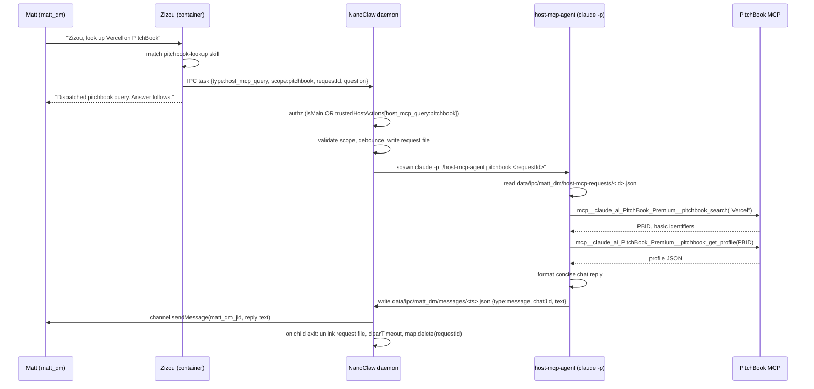
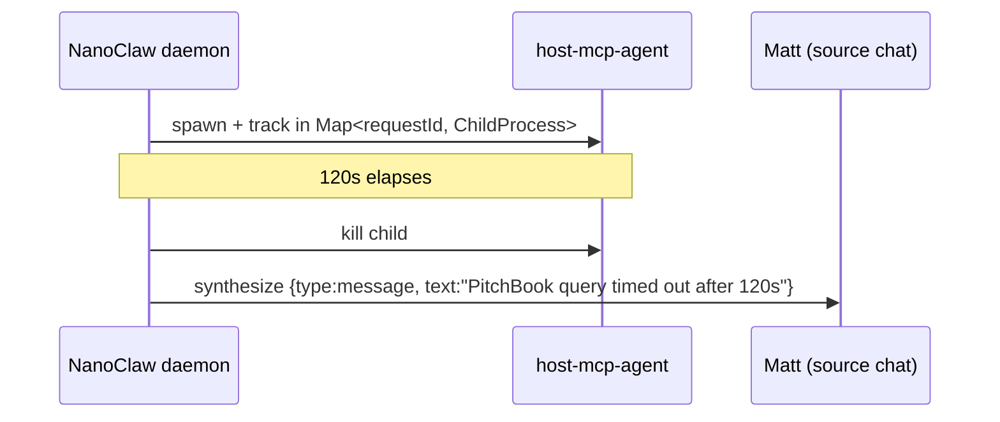

# Host-MCP Proxy for Container Agents

## Overview

Generalize the just-shipped `run_pitchbook_check` pattern into a scoped, free-form host-MCP proxy. A single new IPC tool (`run_host_mcp_query`) lets Zizou invoke any allow-listed host-side MCP scope from chat; the daemon dispatches a one-shot `claude -p` session to a new `host-mcp-agent` host skill that runs the query using only the scope's tool prefix, then writes a `type: "message"` IPC reply that the daemon delivers to the source chat. Credentials never enter the container.

First scope: **pitchbook** (16 of 17 enumerated tools, exposed through one container skill with an embedded 9-row tool-map table). Adding future scopes (Gmail, Drive, BigQuery, Clay, PowerNotes) is configuration + skills, no daemon changes.

---

## Problem Frame

Matt's primary interface with Zizou is DM chat. Today PitchBook access from chat is limited to the watchlist-diff flow (`run_pitchbook_check`). Free-form queries — company lookups, portfolio pulls, report analysis, news, transcripts — require Matt to drop into his own interactive Claude Code session and use the `/pitchbook-alerts` slash command, which defeats the point of a DM-first assistant.

The underlying constraint is credential isolation: PitchBook MCP auth lives in Matt's user-level Claude.ai session and must not enter the container. The existing IPC trigger pattern already solves this for one narrow flow — the plan generalizes it (see origin: `docs/brainstorms/host-mcp-proxy-requirements.md`).

---

## Requirements Trace

- **R1.** From `matt_dm`, Zizou can answer free-form PitchBook queries (lookup, profile, portfolio, reports, news, transcripts) with the answer arriving in the same chat.
- **R2.** Adding a new scope requires only a scope-registry entry + one host skill update + one or more container SKILL.md files — no changes to `src/ipc.ts` handler logic, `ipc-mcp-stdio.ts` tool definitions, or daemon restart beyond the usual rebuild.
- **R3.** A `run_host_mcp_query` call from a non-main, non-trusted group is dropped by the daemon and never reaches the host MCP.
- **R4.** The existing `run_pitchbook_check` watchlist flow continues working unchanged alongside the new proxy.
- **R5.** Credentials stay host-side — the container only sees the user's question.
- **R6.** When the host-side query times out, errors, or returns an MCP-auth failure, the user receives a plain-text failure message in the source chat rather than silent dispatch-then-nothing.

**Origin actors:** A1 Matt (end user), A2 Zizou (container agent), A3 NanoClaw daemon, A4 host-side Claude session (`claude -p`), A5 Claude.ai-managed PitchBook MCP.

**Origin flows:** F1 Free-form host-MCP query (container → daemon → host skill → source chat), F2 Failure/timeout delivery (host skill or daemon → source chat).

**Origin acceptance examples:**
- **AE1.** (covers R1) "Zizou, look up Vercel on PitchBook" from `matt_dm` → profile summary arrives as a chat message within 60s.
- **AE2.** (covers R1) "Zizou, pull Thrive Capital's portfolio" → readable portfolio list arrives in-chat.
- **AE3.** (covers R3) Same tool call from an untrusted non-main group → daemon drops, no MCP call, no reply.
- **AE4.** (covers R2) Adding a Gmail stub scope = 1 registry entry + `host-mcp-agent` change + ≥1 container SKILL.md + DB trustedHostActions entry; zero edits to `src/ipc.ts` handler logic or `ipc-mcp-stdio.ts`.
- **AE5.** (covers R4) Scheduled `run_pitchbook_check` fires against a configured watchlist and delivers its digest unchanged.
- **AE6.** (covers R6) Host-side PitchBook query that errors (auth expired / tool failure) → user sees "PitchBook query failed: <reason>" rather than no response.

---

## Scope Boundaries

- **Not** a generic "run any host claude prompt" tool — scopes are explicit, enumerated, and allowlisted per group
- **Not** changing the existing `run_pitchbook_check` watchlist flow
- **Not** interactive multi-turn conversations between Zizou and the host-side agent — each query is one-shot
- **Not** moving MCPs into the container — host-side is the whole point
- **Not** a multi-tenant gateway — the host MCP must never become accessible to anyone outside Matt's chat scope

### Deferred to Follow-Up Work

- **Gmail / Drive / Calendar / BigQuery / Clay / PowerNotes scopes** — add each when individually needed (each = registry entry + container SKILL.md + `host-mcp-agent` guardrail table update; no daemon work)
- **Scope registry hot-reload / config file** — start hardcoded in `src/ipc.ts`; migrate to `groups/global/host-mcp-scopes.json` when we hit 3+ scopes
- **Per-scope debounce/timeout tuning** — defaults are shared flat consts (`HOST_MCP_DEBOUNCE_MS`, `HOST_MCP_TIMEOUT_MS`) in v1. Per-scope overrides get added only when a second scope demonstrably needs different values
- **Request context enrichment** — MVP passes only the question. If answers are too shallow, revisit passing recent chat history
- **Structured artifact responses out of scope for MVP.** File artifacts (PDFs, JSON attachments) as `type: "file_upload"` IPC objects are not anticipated in Phase 1; consider only if text length becomes a persistent bottleneck
- **Per-user daily rate budget** — debounce handles burst; daily caps are PB's problem if abused
- **Daemon-startup sweep of stale `host-mcp-requests/`** to synthesize "query interrupted" replies for daemon-crash-mid-flight cases. Low priority until observed
- **Scheduled-task-origin invocations** rejected at MCP tool level in v1; a future "scheduled PitchBook digest" use case would explicitly revisit via a different mechanism (e.g., a separate `run_scheduled_host_mcp_query` with different auth)

---

## Context & Research

### Relevant Code and Patterns

- **IPC handler template:** `src/ipc.ts:565-654` — `pitchbook_check` case (authz → validate → debounce → spawn → log). Mirror this shape.
- **MCP tool template:** `container/agent-runner/src/ipc-mcp-stdio.ts:485-518` — `run_pitchbook_check` (schema → `writeIpcFile` → ack). New tool sits before `await server.connect(transport)` at line 583.
- **Trusted-action check:** `src/ipc.ts:566-579` — canonical `isMain || trustedHostActions.includes(...)` pattern; only call site today, worth extracting into a small helper for multi-scope use.
- **Debounce pattern:** `src/ipc.ts:66-67, 595-609` — module-scope `Map<string, number>` + constant `PITCHBOOK_DEBOUNCE_MS`. Key by `${sourceGroup}:${scope}`.
- **Spawn pattern:** `src/ipc.ts:614-626` — `spawn(CLAUDE_BIN, ['-p', '--dangerously-skip-permissions', '/skill-name args'], {cwd, stdio: ['ignore','pipe','pipe'], detached: false})`. No timeout today.
- **Per-group IPC dir:** `src/group-folder.ts:38` — `resolveGroupIpcPath(folder)` with internal `ensureWithinBase` (private, throws on escape). For belt-and-suspenders reuse in this plan, export a new sibling helper `isWithinBase(base, resolved): boolean` that wraps the same check and returns a boolean rather than throwing — see U1.
- **Sub-dir seeding:** `src/container-runner.ts:197-205` — where `messages/`, `tasks/`, `input/` are mkdir'd per group. Extend with `host-mcp-requests/`.
- **Atomic IPC write (container):** `container/agent-runner/src/ipc-mcp-stdio.ts:23-35` — `writeIpcFile(dir, data)`, `.tmp` → rename. Host-side skill must mirror this pattern in Bash.
- **Message delivery:** `src/ipc.ts:123-149` + `src/index.ts:767-782` — `type: "message"` IPC file → `channel.sendMessage(chatJid, formatted)`. Already works for this plan.
- **Allowed-tools wildcard:** `container/agent-runner/src/index.ts:483-503` — `mcp__nanoclaw__*` is already allow-listed, so new MCP tools auto-allow with no edit.
- **Test template:** `src/ipc-auth.test.ts` — 44 authz tests using `_initTestDatabase()` + stubbed `IpcDeps`. Gap: no tests for `pitchbook_check`. `host_mcp_query` tests will use the same template.
- **Sibling host skill:** `.claude/skills/pitchbook-alerts/SKILL.md` — the pattern `host-mcp-agent` extends. Differences: `host-mcp-agent` must honor the source group's dir (not hardcoded `main/`) and must clean up its request file.
- **Container skill template:** `container/skills/send-file/SKILL.md` — short, instruction-only, mcp-tool-triggering skill. Good template for the 9 PitchBook container skills.

### Institutional Learnings

- **No `docs/solutions/` exists** (learnings live in-code, docs/SECURITY.md, and commit messages). Worth capturing host-MCP pattern lessons in a new `docs/solutions/` seed once this ships.
- **Per-group IPC namespace = auth boundary** (commit `6a94aec`): never trust `groupFolder` / `isMain` fields inside an IPC file. `sourceGroup` is resolved from the filesystem path by the watcher. The reply must live under `data/ipc/<source_group>/messages/` (not main) so the same-folder targeting rule applies and a future shared group couldn't cross-post.
- **Agent-runner caching fix** (commit `c497674`): `newestMtime()` walks the whole agent-runner src tree, so adding `run_host_mcp_query` to `ipc-mcp-stdio.ts` will propagate correctly. Pre-fix, new tools silently missed running group caches.
- **`.env` is mount-shadowed in the container entrypoint** — no single-file mount; not relevant to this plan but a reminder that credentials stay strictly host-side.
- **`run_pitchbook_check` spawn has no timeout or child tracking today** — for a user-triggered free-form query, a hung MCP call would mean user sees nothing. Add wall-clock timeout + daemon-synthesized failure reply.

### External References

- **PitchBook MCP tool set enumerated 2026-04-24:** 17 tools (excluding `pitchbook_get_help_center_analysis` as not user-useful). See brainstorm for the 16→9 skill mapping.
- No external framework research needed — all affected layers have strong local patterns.

---

## Key Technical Decisions

- **Action-name shape:** `host_mcp_query:<scope>` (e.g. `host_mcp_query:pitchbook`). **Rationale:** distinguishes the generalized proxy from the narrow `pitchbook_check` action; scales to many scopes without polluting the allowlist with per-action proliferation.
- **Central authz helper:** Extract `hasTrustedHostAction(registeredGroup, actionName)` → `boolean` from the inline pattern in `src/ipc.ts:566-579`. **Rationale:** one string construction site prevents `split(':')` scatter as scopes multiply; keeps existing `pitchbook_check` case using the same helper for consistency.
- **Scope registry:** Hardcoded `HOST_MCP_SCOPES` module const in `src/ipc.ts`. **Rationale:** brainstorm's MVP; migrate to `groups/global/host-mcp-scopes.json` at 3+ scopes. Each entry is minimal: `{ allowedToolPrefixes: string[] }`. Debounce interval (`HOST_MCP_DEBOUNCE_MS = 30_000`) and timeout (`HOST_MCP_TIMEOUT_MS = 120_000`) are flat module-scope consts shared across scopes for v1 — per-scope tuning fields get added only when a second scope actually needs different values, matching the debounce/timeout precedent at `src/ipc.ts:66`.
- **Input validation before any path construction or spawn.** The daemon validates `requestId` against `/^[a-f0-9]{8}-[a-f0-9]{4}-[a-f0-9]{4}-[a-f0-9]{4}-[a-f0-9]{12}$/` (UUID v4 shape), `scope` against `/^[a-z][a-z0-9_-]{0,31}$/`, and `sourceGroup` against the existing `GROUP_FOLDER_PATTERN` (`/^[A-Za-z0-9][A-Za-z0-9_-]{0,63}$/` from `src/group-folder.ts`) — then confirms `scope` exists in the registry via `Object.prototype.hasOwnProperty.call(HOST_MCP_SCOPES, scope)`. All validation runs **before** any filesystem write or spawn. **Rationale:** `requestId` and `scope` originate from the (untrusted) container agent and get interpolated into a filesystem path and an argv string respectively. `sourceGroup` is filesystem-derived (trusted source) but still interpolates into a slash-command argv string; shape-validation at the argv boundary is cheap belt-and-suspenders. Without strict shape validation, a prompt-injected Zizou could pass `requestId="../messages/forged"` and cause the daemon to write attacker-controlled JSON into `messages/`, bypassing watcher authz. Belt-and-suspenders: export a new `isWithinBase(base, resolved): boolean` helper from `src/group-folder.ts` (wrapping the existing private `ensureWithinBase`); after path construction, re-check with `isWithinBase`. The existing `ensureWithinBase` throws — the new helper exposes a boolean so the handler can drop-and-warn instead of throwing into the watcher loop.
- **Enforce scope tool-prefix allowlist via `--allowed-tools` on the spawn, not just SKILL.md guardrails.** Spawn argv includes `['--allowed-tools', HOST_MCP_SCOPES[scope].allowedToolPrefixes.map(p => p + '*').join(',')]`. **Rationale:** the host `claude -p` session inherits access to every user-level MCP (Gmail, Drive, BigQuery, etc. once those come online). A crafted `question` could attempt to pivot the host agent into calling out-of-scope MCPs, turning this proxy into a prompt-injection-to-arbitrary-MCP primitive on first Gmail install. `--allowed-tools` is the binding enforcement; the SKILL.md scope table becomes belt-and-suspenders documentation.
- **Ship the sandboxed reply primitive in v1, not as deferred hardening.** Add a new host-side MCP tool `host_mcp_reply(chatJid, text)` (runs only in the spawned `claude -p` session, not in Matt's regular interactive session) that is the **only** write primitive the `host-mcp-agent` skill uses to deliver a reply. The daemon includes this in the spawn's `--allowed-tools` alongside the scope prefix and revokes Bash/Write from the session. The tool implementation writes to `data/ipc/<sourceGroup>/messages/` using the sourceGroup baked into the tool's construction, not passed by the agent. **Rationale:** the brainstorm's promise is that future scopes are "config + skill, no daemon changes" — which means whatever TCB primitives the daemon spawns with today get inherited by every future scope. Doing this now is cheap; retrofitting after 3 scopes ship is painful. Also closes the "host agent writes forged task file into main/tasks/" Critical risk without relying on SKILL.md discipline.
- **Concurrency cap on host-MCP spawns.** Module const `MAX_CONCURRENT_HOST_MCP = 4` (tunable). When `hostMcpActiveChildren.size >= MAX`, the handler drops with a synthesized decline reply ("System is busy — try again in a moment"). **Rationale:** with 5-6 scopes × multiple groups and 120s timeouts, concurrent spawns could OOM the host laptop; the sandbox isolation costs ~500MB-1GB RSS per child. 4 is a conservative cap that still allows parallelism across scopes.
- **SIGTERM → SIGKILL two-step on timeout.** Timeout callback sends `child.kill('SIGTERM')`; schedules a `SIGKILL` 5 seconds later if the child hasn't exited. Exit handler clears both. **Rationale:** `claude -p` may be blocked on an MCP network socket and ignore SIGTERM; without SIGKILL escalation, `hostMcpActiveChildren` and `setTimeout` leak. Matches the `container-runner.ts:474` precedent.
- **Bounded child output buffer.** Module const `MAX_CHILD_OUTPUT_BYTES = 512 * 1024`; stdout/stderr `on('data')` handlers append until the cap, then stop appending and set a truncation flag logged on exit. **Rationale:** unbounded concatenation with a 120s child + verbose MCP protocol traces + large PitchBook payloads is a daemon memory DoS surface. Matches the intent of `pitchbook_check`'s `stderr.slice(0, 2000)` logging but applies to the accumulation itself.
- **Reject scheduled-task-origin invocations.** The container's `run_host_mcp_query` MCP tool reads `NANOCLAW_IS_SCHEDULED_TASK` env var (set by the container runner on scheduled-task spawns); if set, returns an error response to the agent rather than writing an IPC task. **Rationale:** the risk-table's "user-triggered only" assumption becomes load-bearing if scheduled-task prompts (or prompt-injected scheduled-task prompts) can invoke this tool. MVP: reject at the tool level with a clear message. A future "scheduled PitchBook digest" use case would explicitly revisit this.
- **Synthesize decline replies for all user-triggered rejection paths.** The daemon uses the same reply-synthesis path already built for timeouts to send a plain-text message when: unknown scope, untrusted caller, question-too-long, debounce-hit, path-escape validation failure. **Rationale:** R6 requires failure replies over silent dispatch-then-nothing; the silent-drop paths are a larger UX gap than timeout (which is rare) since debounce hits are common. Synthesis machinery already exists — marginal cost is ~5 LOC of switch branches.
- **Debounce stamp only after successful spawn (not before).** The handler writes the request file and calls `deps.spawnHostClaude(...)`; on `child.on('spawn')` (Node emits this when the child successfully starts) or after verifying `child.pid !== undefined`, then sets the debounce stamp. On synchronous spawn failure (ENOENT, EACCES, OOM) or `child.on('error')` before spawn, rolls back the request file and writes a decline reply. **Rationale:** today's `pitchbook_check` stamps before spawn, meaning a spawn failure leaves the user frozen for 5 minutes with no feedback. User-triggered flows need correctness here; scheduled flows could keep the old order. Also violates R6 otherwise.
- **End-turn instruction baked into the tool + skill.** The `run_host_mcp_query` tool description and the `pitchbook` container skill explicitly instruct Zizou: "After calling this tool, briefly acknowledge to the user and **end your turn immediately**. Do not wait for the answer — it arrives as a separate message." **Rationale:** nothing structurally prevents the LLM from continuing to think after the ack; an explicit imperative shifts the default. Cheap to add.
- **Daemon-owned request-file cleanup.** The daemon's `child.on('exit')` handler unlinks `data/ipc/<sourceGroup>/host-mcp-requests/<requestId>.json`, not the host skill. **Rationale:** request-file cleanup shouldn't depend on a potentially-compromised or crashed host-side agent. Daemon cleanup is reliable regardless of skill behavior.
- **Debounce key:** `${sourceGroup}:${scope}`. **Rationale:** user-triggered queries; bursts come from typos or context-switching; 30s default is forgiving enough not to frustrate Matt but blocks obvious prompt-injection loops.
- **Wall-clock timeout + daemon-synthesized failure reply:** The daemon tracks spawned children in `Map<requestId, ChildProcess>`; on timeout kills the child and writes a user-facing `"PitchBook query timed out after Ns"` message to `data/ipc/<sourceGroup>/messages/`. **Rationale:** today's `pitchbook_check` has no timeout; extending to free-form user queries without one means silent hangs. 120s default, per-scope override via registry.
- **Spawn seam for tests:** Add `spawnHostClaude(argv, opts)` to `IpcDeps`. **Rationale:** mirrors existing deps style (`sendMessage`, `sendFile`); lets `ipc-auth.test.ts` assert spawn-or-not without actually invoking claude.
- **Reply write location:** Host-side `host-mcp-agent` skill writes `type: "message"` replies into `data/ipc/<source_group>/messages/` (not `main/`). **Rationale:** preserves the per-group-dir-is-identity invariant; enables future shared groups to use the proxy without architectural rework.
- **Atomic write on host side:** `host-mcp-agent` SKILL.md instructs the agent to use `Bash("mv <tmp> <final>")` after `Write(<tmp>)`. **Rationale:** the watcher polls at 1s; partial writes would occasionally JSON.parse-fail. Matches the container-side `writeIpcFile` convention.
- **Host-skill write-scope constraint (SKILL.md-enforced):** `host-mcp-agent` MUST write reply files only to `data/ipc/<sourceGroup>/messages/` where `sourceGroup` is the positional argv passed by the daemon, and MUST NOT write to any `tasks/` directory, any other group's `messages/`, or `main/messages/` unless `sourceGroup === main`. **Rationale:** the host-side claude session runs with full user filesystem privileges — it sits inside the TCB. A prompt-injected host agent could, absent this constraint, drop a `type: "register_group"` file into `data/ipc/main/tasks/` and the daemon would execute it as main-privileged. SKILL.md instruction is the available enforcement today; sandboxing the write primitive is deferred architectural work.
- **Container skill count:** 9 skills (2 entity + 4 composed-entity + 3 content/analysis). **Rationale:** granular enough to keep Zizou's loaded skill context tight; matches the real PitchBook MCP tool shape (finalized 2026-04-24).
- **No new dependencies, no Dockerfile changes, no DB schema migration.** `trustedHostActions` is opaque JSON in `registered_groups.container_config`; new action names just append.
- **Ship the generalized primitive now rather than `run_pitchbook_query` as one-off.** The brainstorm notes that "real usage across 2–3 scopes will reshape the pattern" — a valid argument for deferring the abstraction. Counter-argument this plan stakes: the *infrastructure cost* of the generalized path (scope registry, `--allowed-tools`, `host_mcp_reply` primitive, TCB discipline) is identical whether we label the tool `run_pitchbook_query` or `run_host_mcp_query(scope, …)`. A one-off tool would need the same argv sandboxing, same reply primitive, same sweep/cleanup — renaming it `pitchbook` doesn't cut complexity, just hides the extensibility contract. Paying the rename later (first time Gmail lands) is a larger refactor than picking the right abstraction once. **Accepted trade:** v1 registry has one entry; the API shape is what we're committing to, not the scope count. If scope #2 reshapes the pattern, that's one scope's worth of rework — fine. If we hadn't generalized, renaming + refactoring the MCP tool at scope #2 is also a day of work. Roughly break-even in cost; strictly better in identity (the tool's name tells future-Matt what it does).

---

## Open Questions

### Resolved During Planning

- **Scope registry config location:** Hardcoded in `src/ipc.ts` for MVP; migrate to `groups/global/host-mcp-scopes.json` when scopes reach 3+. (Matches brainstorm recommendation.)
- **Request context:** Question alone; no chat history passed to the host agent. Revisit only if answers are shallow in practice.
- **Reply length policy:** Host agent decides; daemon's existing chat-send splitting handles channel-specific caps.
- **Failure delivery layering:** Host skill handles MCP-level errors (auth expired, tool failure, empty result) by writing a plain-text reply; daemon handles timeout by killing the child and synthesizing its own reply.
- **Action-name shape:** `host_mcp_query:<scope>` with `hasTrustedHostAction` helper.
- **Spawn seam:** `spawnHostClaude` injected via `IpcDeps`.

### Deferred to Implementation

- **Exact decline-reply wording** — implementer may tune (first pass: "PitchBook query timed out after 120s. Try again or simplify the question." / "You're asking too fast — wait a few seconds." / "Host-MCP proxy is busy; try again shortly."). Observed failure modes may inform better copy.
- **`--mcp-config` wiring for U8** — the exact argv shape for adding the per-spawn `host_mcp_reply` MCP server depends on the current Claude Agent SDK's `--mcp-config` syntax. U8's technical design sketches it; verify at implementation time.
- **Whether the single `pitchbook` skill needs to split later** — Zizou's routing accuracy on overlapping triggers is the decision criterion. Start with one; split if observed.

### Deferred Product / Architecture Questions

- **Identity framing in Problem Frame** — this plan changes what Zizou *is* (DM concierge fronting Matt's full host-side MCP stack, not just a container agent). Worth stating explicitly as product positioning but not load-bearing for this PR; revisit if a second scope lands.
- **How Matt edits `trustedHostActions` without direct SQLite access** — there's no IPC tool to mutate the allowlist on a registered group. Main-group re-`register_group` with new `containerConfig` overwrites. A small `update_trusted_actions` IPC would be nicer. Tracked but out of scope.
- **Scope registry config-file migration point** — hardcoded at v1; move to `groups/global/host-mcp-scopes.json` when we hit 3+ scopes. The move becomes cheaper if we settle the schema at scope #2 rather than #3.
- **Scheduled PitchBook digest** (legitimate scheduled-task invocation of host-MCP): v1 rejects all scheduled-task invocations at the MCP tool level. A future design would need either a separate tool with different auth or a signed-token pattern where a trusted scheduler can invoke.

### FYI (advisory — anchor 50 from review)

- **16→9 skill mapping** from the brainstorm is not enumerated inline in this plan; readers needing the full PB tool list consult the brainstorm doc.
- **Request file retention** — `data/ipc/<group>/host-mcp-requests/<id>.json` contains the user's question plaintext and is unlinked on child exit. If retention policy becomes a concern (multi-user, audit), add rotation.
- **UUID idempotency** — `crypto.randomUUID` collision probability is negligible, but LLM-retry semantics aren't explicitly guarded beyond the duplicate-dispatch check noted in Risks.
- **Sequence diagram still simplifies the authz step** — the diagram's "authz" label conflates `isMain OR trustedHostActions` with scope-registry lookup; the handler prose (U1) is the authoritative order.

---

## Output Structure

Plan creates and modifies these files (repo-relative):

```
src/
├── ipc.ts                                   (modified: new handler, helper, registry, deps)
├── types.ts                                 (modified: IpcDeps.spawnHostClaude signature)
├── index.ts                                 (modified: wire spawnHostClaude into deps)
├── container-runner.ts                      (modified: mkdir host-mcp-requests/; NANOCLAW_IS_SCHEDULED_TASK env)
├── group-folder.ts                          (modified: export new isWithinBase helper)
├── host-mcp-reply-server.ts                 (NEW: per-spawn stdio MCP server — host_mcp_reply tool)
└── ipc-auth.test.ts                         (modified: new describe block for host_mcp_query + pitchbook_check)

container/agent-runner/src/
└── ipc-mcp-stdio.ts                         (modified: new server.tool block + scheduled-task gate)

.claude/skills/
└── host-mcp-agent/
    └── SKILL.md                             (NEW)

container/skills/
└── pitchbook/SKILL.md                       (NEW: single skill with embedded tool-map table)
```

No Dockerfile, `package.json`, or DB schema changes. `matt_dm`'s `container_config.trustedHostActions` JSON gets one appended string at rollout (ops step — see Operational Notes).

---

## High-Level Technical Design

> *This illustrates the intended approach and is directional guidance for review, not implementation specification. The implementing agent should treat it as context, not code to reproduce.*

### Sequence: happy path (Matt asks Zizou for Vercel's PB profile)



### Sequence: failure (timeout)



### Decision matrix: authz gate

| Caller | `isMain` | `trustedHostActions` contains `host_mcp_query:<scope>` | Scope known? | Outcome |
|---|---|---|---|---|
| `main` group | ✓ | irrelevant | ✓ | allow |
| `main` group | ✓ | irrelevant | ✗ | drop, warn |
| Trusted group | ✗ | ✓ | ✓ | allow |
| Trusted group | ✗ | ✓ | ✗ | drop, warn |
| Untrusted group | ✗ | ✗ | — | drop, warn |
| Debounce window hit | — | — | — | drop, warn |

---

## Implementation Units

- [ ] **U1. Scope registry, helper, handler, and spawn seam in `src/ipc.ts`**

**Goal:** Add the `host_mcp_query` IPC handler, scope registry, trusted-action helper, and inject the spawn seam through `IpcDeps` so tests can stub.

**Requirements:** R1, R2, R3, R5, R6

**Dependencies:** None (foundation unit)

**Files:**
- Modify: `src/ipc.ts`
- Modify: `src/types.ts` (add `spawnHostClaude` to `IpcDeps` signature — the interface currently lives in `src/ipc.ts`, verify and move or extend in place)
- Modify: `src/index.ts` (wire `spawnHostClaude` dep)

**Approach:**
- **Module-scope state:**
  - `HOST_MCP_SCOPES: Record<string, { allowedToolPrefixes: string[] }>` with one entry for `pitchbook`
  - `HOST_MCP_DEBOUNCE_MS = 30_000`, `HOST_MCP_TIMEOUT_MS = 120_000`, `HOST_MCP_KILL_GRACE_MS = 5_000`, `HOST_MCP_MAX_QUESTION_LEN = 4000`, `MAX_CONCURRENT_HOST_MCP = 4`, `MAX_CHILD_OUTPUT_BYTES = 512 * 1024`
  - `REQUEST_ID_PATTERN = /^[a-f0-9]{8}-[a-f0-9]{4}-[a-f0-9]{4}-[a-f0-9]{4}-[a-f0-9]{12}$/`, `SCOPE_NAME_PATTERN = /^[a-z][a-z0-9_-]{0,31}$/`
  - `hostMcpLastRun: Map<string, number>` keyed `${sourceGroup}:${scope}`
  - `hostMcpActiveChildren: Map<string, ChildProcess>` keyed by `requestId`
- **Helpers (new):**
  - Extract `hasTrustedHostAction(reg: RegisteredGroup | undefined, action: string): boolean`; refactor `pitchbook_check` case to use it
  - Export new `isWithinBase(baseDir: string, resolvedPath: string): boolean` from `src/group-folder.ts` wrapping the existing private `ensureWithinBase` check but returning a bool (no throw)
  - Add `synthesizeFailureReply(sourceGroup: string, chatJid: string, text: string): void` that writes a `type: "message"` IPC file to `data/ipc/<sourceGroup>/messages/` atomically
- **Deps:** Add `spawnHostClaude(argv, opts) => ChildProcess` to `IpcDeps`; default impl in `src/index.ts` wraps `child_process.spawn(CLAUDE_BIN, argv, opts)`
- **Handler ordering (new `host_mcp_query` case):**
  1. **Shape-validate all untrusted fields:** `SCOPE_NAME_PATTERN.test(scope)`, `REQUEST_ID_PATTERN.test(requestId)`, `GROUP_FOLDER_PATTERN.test(sourceGroup)`, `question.length <= HOST_MCP_MAX_QUESTION_LEN`. On failure → `synthesizeFailureReply("Invalid request format.")` + warn log
  2. **Registry own-property check:** `Object.prototype.hasOwnProperty.call(HOST_MCP_SCOPES, scope)`. On miss → `synthesizeFailureReply("Unknown scope: <scope>.")` + warn
  3. **Authz:** `isMain || hasTrustedHostAction(reg, \`host_mcp_query:${scope}\`)`. On fail → `synthesizeFailureReply("Not authorized to call this scope.")` + warn
  4. **Concurrency gate:** if `hostMcpActiveChildren.size >= MAX_CONCURRENT_HOST_MCP` → `synthesizeFailureReply("Host-MCP proxy is busy; try again shortly.")` + warn
  5. **Debounce gate:** if `now - hostMcpLastRun.get(key) < HOST_MCP_DEBOUNCE_MS` → `synthesizeFailureReply("You're asking too fast — try again in a few seconds.")` + warn. (Do **not** stamp yet.)
  6. **Safe path construction:** `hostMcpBase = path.join(resolveGroupIpcPath(sourceGroup), 'host-mcp-requests')`; `requestPath = path.join(hostMcpBase, \`${requestId}.json\`)`; if `!isWithinBase(hostMcpBase, requestPath)` → `synthesizeFailureReply("Invalid request identifier.")` + warn (defense-in-depth)
  7. **Write request file atomically:** `writeIpcFileAtomic(requestPath, { question, chatJid, sourceGroup, scope })` (.tmp → rename)
  8. **Spawn (Option C partial sandbox):** `argv = ['-p', '--dangerously-skip-permissions', '--tools', '', '--allowed-tools', scopePrefixes + ',mcp__nanoclaw_host__host_mcp_reply', '--disallowed-tools', otherKnownMcpPrefixes, \`/host-mcp-agent ${scope} ${sourceGroup} ${requestId}\`]`. `--tools ""` hard-denies built-in tools; `--allowed-tools` is the auto-approve hint for the in-scope MCP + the reply primitive from U8; `--disallowed-tools` enumerates other known third-party MCPs (Gmail/Drive/Calendar/BigQuery/Clay/PowerNotes — see `KNOWN_HOST_MCP_PREFIXES`) to defend against MCP cross-pollination. `deps.spawnHostClaude(argv, { cwd, stdio: ['ignore','pipe','pipe'] })`
  9. **Confirm spawn success:** attach `child.on('error', err => { unlink(requestPath); synthesizeFailureReply(...); /* do NOT stamp debounce */ })` and `child.on('spawn', () => { hostMcpLastRun.set(key, now); })`. Only stamp debounce after spawn emits `spawn` (meaning the OS accepted the fork/exec)
  10. **Track child:** `hostMcpActiveChildren.set(requestId, child)`
  11. **Buffer output with cap:** accumulate stdout/stderr via `on('data')` until `MAX_CHILD_OUTPUT_BYTES`; after cap, drop further chunks and set a `truncated` flag
  12. **Timeout (two-step):** `setTimeout(() => { child.kill('SIGTERM'); synthesizeFailureReply(\`\${scope} query timed out after \${HOST_MCP_TIMEOUT_MS/1000}s\`); setTimeout(() => child.kill('SIGKILL'), HOST_MCP_KILL_GRACE_MS); }, HOST_MCP_TIMEOUT_MS)`
  13. **Exit handler (`try/finally`):** clearTimeout (both timers), `hostMcpActiveChildren.delete(requestId)`, `fs.unlinkSync(requestPath)` (swallow ENOENT), log `{requestId, scope, code, signal, stdoutLen, stderrLen, durationMs, truncated}`. Do **not** synthesize a success reply — that's the host skill's job via `host_mcp_reply`
- **Never synthesize a success reply at the daemon** — the daemon only narrates failures and rejections. Success replies come from the `host_mcp_reply` MCP tool (U8)

**Execution note:** Start with failing tests (U6) for the 8 branches before implementing; the seam (`spawnHostClaude`) and the bounded test surface make TDD cheap here.

**Execution note:** Add unit tests in U6 as the handler grows; the seam (`spawnHostClaude`) exists specifically to make this testable.

**Technical design:** *(directional — not implementation specification)*

```ts
// Registry (minimal) + flat tuning consts
const HOST_MCP_SCOPES = {
  pitchbook: { allowedToolPrefixes: ['mcp__claude_ai_PitchBook_Premium__'] },
} as const;
const HOST_MCP_DEBOUNCE_MS = 30_000;
const HOST_MCP_TIMEOUT_MS  = 120_000;
const HOST_MCP_KILL_GRACE_MS = 5_000;
const MAX_CONCURRENT_HOST_MCP = 4;
const MAX_CHILD_OUTPUT_BYTES = 512 * 1024;

// Handler sketch (not runnable — order is load-bearing; see Approach for full prose)
case 'host_mcp_query': {
  const { scope, question, requestId, chatJid } = data;
  const reject = (msg: string) => { synthesizeFailureReply(sourceGroup, chatJid, msg); logger.warn({requestId, scope, sourceGroup}, msg); };

  // (1) Shape validation before ANY path construction or spawn
  if (!SCOPE_NAME_PATTERN.test(scope) ||
      !REQUEST_ID_PATTERN.test(requestId) ||
      !GROUP_FOLDER_PATTERN.test(sourceGroup) ||
      question.length > HOST_MCP_MAX_QUESTION_LEN) {
    return reject('Invalid request format.');
  }
  // (2) Registry own-property check (prototype-pollution-safe)
  if (!Object.prototype.hasOwnProperty.call(HOST_MCP_SCOPES, scope)) {
    return reject(`Unknown scope: ${scope}.`);
  }
  // (3) Authz
  const reg = findReg(sourceGroup);
  if (!isMain && !hasTrustedHostAction(reg, `host_mcp_query:${scope}`)) {
    return reject('Not authorized.');
  }
  // (4) Concurrency cap
  if (hostMcpActiveChildren.size >= MAX_CONCURRENT_HOST_MCP) {
    return reject('Host-MCP proxy is busy; try again shortly.');
  }
  // (5) Debounce (check only — stamp after spawn success)
  const key = `${sourceGroup}:${scope}`;
  if (Date.now() - (hostMcpLastRun.get(key) ?? 0) < HOST_MCP_DEBOUNCE_MS) {
    return reject("You're asking too fast — wait a few seconds.");
  }
  // (6) Safe path construction
  const hostMcpBase = path.join(resolveGroupIpcPath(sourceGroup), 'host-mcp-requests');
  const requestPath = path.join(hostMcpBase, `${requestId}.json`);
  if (!isWithinBase(hostMcpBase, requestPath)) {
    return reject('Invalid request identifier.');
  }
  // (7) Write request atomically, (8) spawn with sandbox
  writeIpcFileAtomic(requestPath, { question, chatJid, sourceGroup, scope });
  const allowedTools = [
    ...HOST_MCP_SCOPES[scope].allowedToolPrefixes.map(p => p + '*'),
    'mcp__nanoclaw_host__host_mcp_reply',
  ].join(',');
  const child = deps.spawnHostClaude([
    '-p', '--dangerously-skip-permissions',
    '--allowed-tools', allowedTools,
    `/host-mcp-agent ${scope} ${sourceGroup} ${requestId}`,
  ], { cwd, stdio: ['ignore','pipe','pipe'] });

  // (9) Confirm spawn success before stamping debounce; handle spawn failure
  child.on('spawn', () => { hostMcpLastRun.set(key, Date.now()); });
  child.on('error', (err) => {
    try { fs.unlinkSync(requestPath); } catch {}
    synthesizeFailureReply(sourceGroup, chatJid, 'Could not start host-MCP query.');
    logger.error({requestId, scope, err}, 'spawn failure');
  });

  // (10) Track + bounded output buffering
  hostMcpActiveChildren.set(requestId, child);
  const buf = { stdout: '', stderr: '', truncated: false };
  const append = (stream: 'stdout'|'stderr') => (c: Buffer) => {
    const s = c.toString();
    if (buf[stream].length + s.length > MAX_CHILD_OUTPUT_BYTES) { buf.truncated = true; return; }
    buf[stream] += s;
  };
  child.stdout?.on('data', append('stdout'));
  child.stderr?.on('data', append('stderr'));

  // (11) Two-step timeout (SIGTERM → SIGKILL)
  let killTimer: NodeJS.Timeout | undefined;
  const softTimer = setTimeout(() => {
    synthesizeFailureReply(sourceGroup, chatJid, `${scope} query timed out after ${HOST_MCP_TIMEOUT_MS/1000}s.`);
    child.kill('SIGTERM');
    killTimer = setTimeout(() => child.kill('SIGKILL'), HOST_MCP_KILL_GRACE_MS);
  }, HOST_MCP_TIMEOUT_MS);

  // (12) Exit cleanup (always runs, even if logging throws)
  child.on('exit', (code, signal) => {
    try {
      logger.info({requestId, scope, code, signal, stdoutLen: buf.stdout.length, stderrLen: buf.stderr.length, truncated: buf.truncated}, 'host_mcp_query exit');
    } finally {
      clearTimeout(softTimer);
      if (killTimer) clearTimeout(killTimer);
      hostMcpActiveChildren.delete(requestId);
      try { fs.unlinkSync(requestPath); } catch {}
    }
  });
  break;
}
```

**Patterns to follow:**
- `src/ipc.ts:565-654` (`pitchbook_check` handler shape)
- `src/ipc.ts:66-67` (Map + constant at module scope)
- `src/group-folder.ts:38` (`resolveGroupIpcPath` for sub-dir resolution)

**Test scenarios** *(consolidated — one per distinct control-flow branch; tests land in U6):*

*Happy path:*
- **T1.** `isMain=true`, known scope, UUID-v4 requestId → `spawnHostClaude` called with argv containing `--allowed-tools mcp__claude_ai_PitchBook_Premium__*,mcp__nanoclaw_host__host_mcp_reply`; child registered; debounce stamped on `spawn` event; request file written
- **T2.** Non-main group with `trustedHostActions: ["host_mcp_query:pitchbook"]` → spawn called; behaves identically to main

*Input-validation branch (table-driven):*
- **T3.** Shape-invalid input causes decline reply + no spawn. Parameterized inputs: `scope="foo bar"` / `"../x"` / `"__proto__"` / `""`; `requestId="../messages/forged"` / `"nonsense"`; `sourceGroup="../../etc"`; `question=<4001 chars>`. Each row: asserts `deps.spawnHostClaude` NOT called AND a failure reply was written to `data/ipc/<group>/messages/`

*Registry / authz / gating branches:*
- **T4.** Unknown scope (`scope="gmail"` with only `pitchbook` registered) → decline reply "Unknown scope", no spawn
- **T5.** Untrusted non-main group (no matching action) → decline reply "Not authorized", no spawn
- **T6.** `hostMcpActiveChildren.size === MAX_CONCURRENT_HOST_MCP` pre-populated → decline reply "busy", no spawn
- **T7.** Back-to-back within `HOST_MCP_DEBOUNCE_MS` for same `{sourceGroup, scope}` → second gets decline reply "too fast"; first still in flight unaffected. Different `{sourceGroup, scope}` → both allowed

*Path-escape defense:*
- **T8.** `isWithinBase` returns `false` (mocked) → decline reply "Invalid request identifier", no spawn, no file written *(defense-in-depth beyond regex)*

*Spawn failure + cleanup:*
- **T9.** `spawnHostClaude` returns a child that emits `error` before `spawn` → request file unlinked, decline reply written, debounce **not** stamped, map does not leak
- **T10.** Exit handler cleanup runs in `finally` even when logger throws → `hostMcpActiveChildren.delete` still happens, request file still unlinked

*Timeout (integration, fake timers):*
- **T11.** Child never exits; after `HOST_MCP_TIMEOUT_MS` → failure reply written AND `child.kill('SIGTERM')` called. After `HOST_MCP_KILL_GRACE_MS` more → `child.kill('SIGKILL')` called

*Regression (opportunistic coverage for existing `pitchbook_check`):*
- **T12.** `pitchbook_check` still works after `hasTrustedHostAction` refactor — main + trusted cases allow, untrusted case rejects (closes the pre-existing test gap)

**Verification:**
- `npx tsc --noEmit` clean
- Manual: fire a `host_mcp_query` from `matt_dm` via the new container tool once U3/U4 land; daemon logs show authz pass → spawn → exit
- `src/ipc-auth.test.ts` (expanded in U6) passes

---

- [ ] **U2. `run_host_mcp_query` MCP tool in agent-runner**

**Goal:** Expose the generalized tool to Zizou via the `nanoclaw` stdio MCP server.

**Requirements:** R1, R2

**Dependencies:** U1 (handler must exist before the tool is useful to test end-to-end, but the tool itself can be authored independently)

**Files:**
- Modify: `container/agent-runner/src/ipc-mcp-stdio.ts`

**Approach:**
- Add a single `server.tool('run_host_mcp_query', description, zodSchema, handler)` block before `await server.connect(transport)` at line 583
- Schema (Zod): `{ scope: z.string().regex(/^[a-z][a-z0-9_-]{0,31}$/).describe(...), question: z.string().min(1).max(4000).describe(...) }`. Scope shape-validated client-side as early reject; daemon re-validates authoritatively. Schema doesn't enumerate scopes (don't leak the server-side list)
- **Scheduled-task gate:** at handler entry, if `process.env.NANOCLAW_IS_SCHEDULED_TASK === '1'`, return `{ content: [{ type: 'text', text: "Error: run_host_mcp_query is not available in scheduled-task context. User-triggered only." }], isError: true }` without writing any IPC file. The container runner sets this env var on scheduled-task spawns (verify/wire in U3)
- Handler: generate `requestId = crypto.randomUUID()`; `writeIpcFile(TASKS_DIR, { type: 'host_mcp_query', scope, question, requestId, groupFolder, chatJid: NANOCLAW_CHAT_JID, timestamp: ... })`; return `{ content: [{ type: 'text', text: "Dispatched <scope> query. Answer follows as a separate message. **End your turn now — do not wait or retry.**" }] }`
- Tool description **must explicitly instruct the agent to end its turn** after calling: "After calling this tool, briefly acknowledge to the user and end your turn immediately. Do NOT wait for the answer — it arrives as a separate chat message. Do NOT retry the tool while waiting — duplicate dispatch is rejected by debounce."

**Patterns to follow:**
- `container/agent-runner/src/ipc-mcp-stdio.ts:485-518` (`run_pitchbook_check` shape)
- `container/agent-runner/src/ipc-mcp-stdio.ts:23-35` (`writeIpcFile` atomic pattern)

**Test scenarios:**
- Test expectation: none — this module is too thin to test usefully; verification is via end-to-end exercise in U8 and the daemon-side tests in U6. Existing `ipc-mcp-stdio.ts` has no unit tests by precedent.

**Verification:**
- Rebuild agent-runner cache (or delete `data/sessions/<folder>/agent-runner-src/`), restart container, confirm `run_host_mcp_query` appears in Zizou's tool list
- Calling the tool produces a JSON task file under `data/ipc/<group>/tasks/` with `type:"host_mcp_query"` and correct fields

---

- [ ] **U3. Per-group `host-mcp-requests/` subdir seeding**

**Goal:** Ensure the per-group IPC subdir exists before the container writes to it.

**Requirements:** R3 (per-group namespace isolation)

**Dependencies:** None

**Files:**
- Modify: `src/container-runner.ts`

**Approach:**
- Add `fs.mkdirSync(path.join(groupIpcDir, 'host-mcp-requests'), { recursive: true });` to the sub-dir seeding block at `src/container-runner.ts:197-205`
- Wire `NANOCLAW_IS_SCHEDULED_TASK=1` into the container env dict when `runContainerAgent` is invoked from the task scheduler (`src/task-scheduler.ts:173-202`). This is how U2's scheduled-task gate knows it's in a scheduled context
- No other changes; the IPC dir is mounted into container at `/workspace/ipc/host-mcp-requests/` by the existing `groupIpcDir` mount

**Patterns to follow:**
- `src/container-runner.ts:197-205` (existing mkdir pattern for `messages/`, `tasks/`, `input/`)

**Test scenarios:**
- Test expectation: none — single mkdirSync call; verified transitively by U1/U2 end-to-end tests.

**Verification:**
- Start a container for `matt_dm`; confirm `data/ipc/matt_dm/host-mcp-requests/` exists

---

- [ ] **U4. `host-mcp-agent` host-side skill**

**Goal:** The host-side claude session that executes queries in a scope-constrained context and delivers the answer via the `host_mcp_reply` MCP primitive.

**Requirements:** R1, R5, R6

**Dependencies:** U3 (request dir must exist), U8 (`host_mcp_reply` MCP tool must exist)

**Files:**
- Create: `.claude/skills/host-mcp-agent/SKILL.md`

**Approach:**
- Frontmatter: `name: host-mcp-agent`, `description:` makes clear this is a daemon-invoked skill (not a user-facing slash command)
- SKILL.md instructs the agent to:
  1. Parse invocation args: `/host-mcp-agent <scope> <sourceGroup> <requestId>` — three positional args, in that order
  2. Read the request JSON at exactly `data/ipc/<sourceGroup>/host-mcp-requests/<requestId>.json`. **Never** scan other group dirs
  3. Extract `question`, `chatJid` from the request
  4. Consult an embedded scope-guardrail table (mirrors `HOST_MCP_SCOPES` in `src/ipc.ts`). The agent must only call tools with the scope's allowed prefix — **belt-and-suspenders** with the daemon's `--allowed-tools` argv enforcement (which is the primary defense)
  5. Answer the question using only those MCP tools
  6. Format a concise chat reply (≤ ~400 chars for short answers; longer for list/report requests — let the daemon's chat-send splitting handle overflow)
  7. **Deliver the reply via the `mcp__nanoclaw_host__host_mcp_reply(text)` MCP tool** (see U8). The tool is the **only** write primitive this skill may use — the daemon's `--allowed-tools` argv revokes Bash/Write/Edit, so raw filesystem writes are not possible even if the agent is prompt-injected. `chatJid` is baked into the tool's construction by U8 (not passed by the agent), which eliminates the cross-group write risk at the platform level rather than via SKILL.md discipline
  8. On MCP-level error detection: any `pitchbook_*` tool call that errors with a message matching `/auth|expired|unauthorized|authenticate/i` → treat as auth-expired and reply "PitchBook auth expired — re-authenticate in your Claude Code session (`claude` → `/mcp`)." On any other `pitchbook_*` error → reply "PitchBook query failed: <first 200 chars of error>." On empty results → reply "No results found for: <question summary>." *(Error-string matching is the detection strategy; tool-list introspection is unreliable under `--allowed-tools`)*
  9. **Do not** unlink the request file. The daemon owns request-file cleanup on child exit (see U1 "Daemon-owned request-file cleanup")
- Keep under 500 lines per contributing guide. Includes a small table of PitchBook tool → one-line purpose as in-context reference
- SKILL.md header carries an explicit "Trust model" callout: this skill runs host-side with full user privileges, but is sandboxed to `host_mcp_reply + scope-prefixed MCP tools` via daemon-enforced `--allowed-tools`

**Patterns to follow:**
- `.claude/skills/pitchbook-alerts/SKILL.md` (sibling style, host-side)

**Test scenarios:**
- Test expectation: none — instruction-only skill. Verification by end-to-end exercise during Phase 2 rollout (AE1, AE2, AE6).

**Verification:**
- Manually stage a request file then fire `claude -p --dangerously-skip-permissions --allowed-tools "mcp__claude_ai_PitchBook_Premium__*,mcp__nanoclaw_host__host_mcp_reply" --mcp-config <config> "/host-mcp-agent pitchbook matt_dm <uuid>"`; the skill reads the request, queries PB, calls `host_mcp_reply` — which writes to `data/ipc/matt_dm/messages/`; daemon unlinks the request file on child exit

---

- [ ] **U5. Single `pitchbook` container skill**

**Goal:** One instruction-only SKILL.md that teaches Zizou when and how to invoke `run_host_mcp_query(scope="pitchbook", …)` for the full PitchBook tool surface.

**Requirements:** R1, R2

**Dependencies:** U2 (tool must exist)

**Files:**
- Create: `container/skills/pitchbook/SKILL.md`

**Approach:**
- Frontmatter: `name: pitchbook`, `description:` with the full trigger phrase set from the brainstorm ("find/search/look up", "profile/details on", "deals/investors/financials/team for", "portfolio/investments/funds for", "cap table/participants", "LPs/commitments for", "reports/research", "news on", "earnings call/transcript")
- Body (~100 lines): one paragraph on when this skill fires; a single **Tool map** table embedded in the skill — question shape → expected PB tool — so Zizou (and future agents) have the routing matrix in context without 9 separate files; one canonical example `run_host_mcp_query(scope="pitchbook", question="<natural language>")`; explicit "end your turn" instruction
- Tone: first-person-to-agent imperative, matching `container/skills/send-file/SKILL.md`
- Rationale for 1-not-9: the `question` carries the routing signal; the host agent composes PB tool calls dynamically. Multiple skills with overlapping triggers were a context-hygiene optimization addressing a problem no evidence suggests we have. Can re-split if Zizou demonstrably conflates triggers after real use

**Patterns to follow:**
- `container/skills/send-file/SKILL.md` (short instructional skill template)
- Brainstorm doc's 9-row skill table — ports verbatim as the in-skill tool map

**Test scenarios:**
- Test expectation: none — markdown instruction file; verification by end-to-end exercise during Phase 2 rollout.

**Verification:**
- Restart a container for `matt_dm`; skill syncs to `/home/node/.claude/skills/pitchbook/` via `src/container-runner.ts:178-188`; Zizou lists it; sample queries across the 9 PB flows from the brainstorm route correctly to `run_host_mcp_query`

---

- [ ] **U6. Authorization, validation, and debounce tests**

**Goal:** Protect the handler against regression and establish the test pattern for future scopes. Close the existing gap for `pitchbook_check` while we're in the file.

**Requirements:** R3 (critical — regression protection on the security boundary)

**Dependencies:** U1 (handler must exist)

**Files:**
- Modify: `src/ipc-auth.test.ts`

**Approach:**
- Add a `describe('host_mcp_query authorization', ...)` block
- Use `_initTestDatabase()` + three registered groups (main, trusted, untrusted) per existing test pattern (see `src/ipc-auth.test.ts` top-of-file setup)
- Stub `IpcDeps.spawnHostClaude` with a `vi.fn()` that returns a minimal fake child (`{ on: vi.fn(), stdout: {on: vi.fn()}, stderr: {on: vi.fn()}, kill: vi.fn() }`) — tests assert whether the stub was called, not that claude actually ran
- Opportunistically add a `describe('pitchbook_check authorization', ...)` block covering the existing handler's authz matrix (closes the test gap flagged in research; <20 extra LOC, <5 min effort)

**Execution note:** Start with failing tests for each scenario in U1's test-scenarios list, implement handler adjustments only as needed to make them pass.

**Patterns to follow:**
- `src/ipc-auth.test.ts` (entire file — canonical authz test pattern)

**Test scenarios:**
*See U1's T1–T11 (`host_mcp_query` branches) + T12 (`pitchbook_check` regression) — implemented here.* Additionally:
- **T16.** `hasTrustedHostAction` helper returns correct boolean for each authz input permutation (table-driven: `{isMain: boolean, hasAction: boolean}` → expected)
- **T17.** Decline replies (T3–T8) assert the reply file shape: `{ type: "message", chatJid, text, groupFolder: sourceGroup }` — closing the silent-failure UX gap
- **T18.** Scheduled-task-origin: `NANOCLAW_IS_SCHEDULED_TASK=1` → MCP tool returns `isError: true`, no IPC task file written

**Verification:**
- `npx vitest run src/ipc-auth.test.ts` — all tests pass (new + existing)
- Coverage: all branches of the `host_mcp_query` case exercised at least once

---

> *U7 retired during deepening — the original U7 "Operational: update matt_dm.trustedHostActions" was a single SQL statement; it has been moved into the Rollout subsection of Documentation / Operational Notes. U-ID stability rule preserves the gap; next unit resumes at U8.*

---

- [ ] **U8. Host-side `host_mcp_reply` MCP tool (sandboxed reply primitive)**

**Goal:** Ship a host-side MCP server that exposes exactly one tool — `host_mcp_reply(text)` — to the spawned `claude -p` session. This is the `host-mcp-agent` skill's **only** write primitive. `chatJid` and `sourceGroup` are baked in at construction, not passed by the agent. Closes the Critical-severity "host agent writes forged task file into main/tasks/" risk at the platform level.

**Requirements:** R1, R5, R6

**Dependencies:** U1 (the daemon needs to know about this MCP server to include it in `--allowed-tools` and wire its socket)

**Files:**
- Create: `src/host-mcp-reply-server.ts` (a tiny stdio MCP server, analogous in shape to `container/agent-runner/src/ipc-mcp-stdio.ts` but host-side and per-spawn)
- Create: `src/host-mcp-reply-server.test.ts` (unit tests T13–T15)
- Modify: `src/ipc.ts` (U1 spawn argv already includes the tool name in `--allowed-tools`; ensure the spawned process can reach this MCP server — via a `--mcp-config` arg pointing at a per-spawn JSON config that registers this server with `chatJid` + `sourceGroup` baked into its startup args)

**Approach:**
- The daemon writes a per-spawn `data/ipc/<sourceGroup>/host-mcp-requests/<requestId>.mcp-config.json` containing the MCP server registration: `{ mcpServers: { nanoclaw_host: { command: "node", args: ["src/host-mcp-reply-server.js", sourceGroup, chatJid, requestId] } } }`
- Spawn argv gets `--mcp-config <that-path>` added. This makes `mcp__nanoclaw_host__host_mcp_reply` available in the session — and **only** in that session
- The MCP server reads `sourceGroup`, `chatJid`, `requestId` from its own argv at startup and holds them as private state. `host_mcp_reply(text)` writes an atomic `type: "message"` IPC file to `data/ipc/<sourceGroup>/messages/<ts>-<rand>.json` with those values; the agent cannot influence routing
- Agent calls `host_mcp_reply(text="…answer…")`; reply flows through the normal watcher path
- Daemon cleanup (U1 exit handler): also unlink the `.mcp-config.json` file alongside the `.json` request file

**Technical design:** *(directional — not implementation specification)*

```ts
// src/host-mcp-reply-server.ts — stdio MCP server, per-spawn
const [, , sourceGroup, chatJid, requestId] = process.argv;  // trusted — daemon-provided
// validate shapes defensively even though daemon already did
assertShape(sourceGroup, chatJid, requestId);

const server = new McpServer({ name: 'nanoclaw_host', version: '0.1.0' });
server.tool(
  'host_mcp_reply',
  'Deliver the answer to the user. This is your only write primitive. Call exactly once, then exit.',
  { text: z.string().min(1).max(40_000) },
  async ({ text }) => {
    writeIpcFileAtomic(
      path.join(resolveGroupIpcPath(sourceGroup), 'messages', `${Date.now()}-${rand()}.json`),
      { type: 'message', chatJid, text, groupFolder: sourceGroup, timestamp: now() }
    );
    return { content: [{ type: 'text', text: 'Reply delivered.' }] };
  }
);
await server.connect(new StdioServerTransport());
```

**Patterns to follow:**
- `container/agent-runner/src/ipc-mcp-stdio.ts` (stdio MCP server shape, `writeIpcFile` pattern)
- Claude Agent SDK `--mcp-config` documentation

**Test scenarios:**
- **T13.** Starting the server with valid argv: tool registers, responds to `host_mcp_reply({ text: "hi" })` by writing an IPC message file with the hardcoded chatJid/sourceGroup
- **T14.** Agent attempts to pass `chatJid` or `sourceGroup` as tool args → Zod schema rejects (`additionalProperties: false`) — the hardcoded values from argv are the only source of truth
- **T15.** `text` exceeding 40K chars → Zod schema rejects

**Verification:**
- Unit-test the server module by invoking its tool handler with mocked `fs`
- E2E: spawn the daemon's flow end-to-end; confirm agent's reply arrives in the correct chat and **only** in the correct chat

---

## System-Wide Impact

- **Interaction graph:** container `run_host_mcp_query` tool → daemon IPC watcher (`startIpcWatcher`) → new `host_mcp_query` case in `processTaskIpc` → `spawnHostClaude` → host `claude -p` → `.claude/skills/host-mcp-agent/SKILL.md` → PitchBook MCP → reply IPC file → watcher → `channel.sendMessage`. Two callback-heavy spawn boundaries (stdout, exit, timeout) in the daemon.
- **Error propagation:** Host-agent errors surface as plain-text reply files (normal IPC path). Daemon-side errors (spawn failure, timeout) surface as synthesized reply files written by the timeout callback. Watcher-level JSON errors move to `data/ipc/errors/<group>-<file>` (existing pattern, unchanged).
- **State lifecycle risks:** `hostMcpActiveChildren` map must be cleared on exit **and** on timeout kill — both paths must call `map.delete(requestId)` and `clearTimeout` to avoid memory growth. Request files are unlinked by the daemon's child-exit handler (not the host skill); if the daemon crashes between spawn and exit, the file persists — see deferred sweeper item. Tests cover the active-map cleanup.
- **API surface parity:** The `host_mcp_query:<scope>` allowlist convention sits alongside the existing `pitchbook_check` flat action name. Flat actions remain — no rename needed. Future actions should follow the namespaced convention where a scope parameter exists; flat where it doesn't.
- **Integration coverage:** End-to-end tests are manual (AE1-AE6); vitest covers authz/validation/debounce/timeout at the handler level. PB MCP is out-of-process and can't be mocked practically — that's fine; handler tests are the risk boundary.
- **Unchanged invariants:**
  - `run_pitchbook_check` handler, tool, and watchlist skill continue working — explicitly tested for regression in U6
  - Per-group IPC namespace = auth boundary for the **container** (no change; container can only write into its own group's IPC subtree). The **host-side** claude session has full filesystem privileges at the OS level but is sandboxed at the tool level via Option C: `--tools ""` hard-denies built-in tools (Bash/Read/Edit/Write/...), `--allowed-tools` grants only the scope's PB prefix plus `host_mcp_reply`, and `--disallowed-tools` enumerates other known third-party MCPs. The `host_mcp_reply` tool (U8) bakes in `sourceGroup` + `chatJid` so the agent cannot write to the wrong group even if prompt-injected
  - `mcp__nanoclaw__*` allow-listed in container (no change; new tool auto-allows)
  - No new dependencies, no Dockerfile changes, no DB schema migration
- **TCB assumption reduced (not eliminated):** with U8's `host_mcp_reply` primitive and Option C's `--tools ""` revoking Bash/Read/Edit/Write from the host session, the remaining TCB trust is that the MCP protocol itself enforces the allowlist (it does, at the Claude SDK layer). A sufficiently sophisticated prompt injection of an agent with **only** PitchBook tools + `host_mcp_reply` can do exactly two things: (1) query PitchBook under Matt's auth, (2) write a reply to Matt's source chat. It cannot reach `data/ipc/*/tasks/`, other groups, or the filesystem at large. **Residual gap:** any user-scope MCP installed *after* this ships and not yet added to `KNOWN_HOST_MCP_PREFIXES` is reachable from any scope via `--allowed-tools` auto-approve behavior — the maintenance discipline is a guardrail, not a hard wall. Stronger fix tracked in the risk table: `--strict-mcp-config` with per-scope MCP server registration

---

## Risks & Dependencies

| Risk | Likelihood | Impact | Mitigation |
|------|-----------|--------|------------|
| **Prompt-injected question pivots host agent to non-PB MCPs** (e.g., Gmail exfiltration once Gmail MCP is configured) | Low (today — no second MCP) / Medium (post-Gmail) | **Critical** | **Partial sandbox (Option C — what shipped):** spawn argv combines (a) `--tools ""` to hard-deny every built-in tool (Bash/Read/Edit/Write/...), (b) `--allowed-tools mcp__claude_ai_PitchBook_Premium__*,mcp__nanoclaw_host__host_mcp_reply` as the auto-approve hint, and (c) `--disallowed-tools` enumerating every other entry in `KNOWN_HOST_MCP_PREFIXES` (Gmail/Drive/Calendar/BigQuery/Clay/PowerNotes) so they're explicitly blocked. **Residual risk:** the claude CLI's `--allowed-tools` is documented as an auto-approve hint, not a hard MCP allowlist — a *new* user-scope MCP installed via `claude mcp add ...` is reachable from any scope until its prefix is added to `KNOWN_HOST_MCP_PREFIXES`. **Stronger long-term fix:** switch to `--strict-mcp-config` and register only the scope's MCP server in our per-spawn `.mcp-config.json`; that eliminates the inherited-config blast radius entirely (deferred — requires copying the user-scope MCP server config into ours). |
| **Path traversal via `requestId` escapes per-group IPC dir** | Medium (container agent is the untrusted boundary) | **High** | Three-layer defense in U1: (1) `requestId` UUID-v4 regex, (2) `sourceGroup` matches `GROUP_FOLDER_PATTERN`, (3) resolved final path re-checked with new `isWithinBase()` helper (U1) |
| **Scope-string injection via argv interpolation** | Medium | High | Scope regex + registry own-property check (prototype-pollution-safe via `Object.prototype.hasOwnProperty.call`). No whitespace, quotes, or shell-metacharacters survive the shape regex |
| **Host agent writes forged task file into `data/ipc/*/tasks/`** | Low (post-U8) | Critical | **Architectural mitigation via U8 + Option C sandbox:** `--tools ""` hard-denies Bash/Write/Edit/Read on the host session; the only write primitive is `host_mcp_reply` which bakes in `sourceGroup` + `chatJid` at MCP-server construction. The agent cannot write to tasks/, cannot write to other groups, cannot influence routing |
| **Prompt-injected question exfiltrates Matt's private data back via PB tool call** (e.g., prompt agent to search PB for "<Matt's API key>") | Low-Medium | Medium | Mitigated by question length cap (4000 chars) + host agent's system prompt. Out-of-scope MCPs (which would be the actual exfil vector) are blocked by the Option C `--disallowed-tools` denylist for known-installed MCPs. PitchBook tool responses come back to the host agent and can only reach Matt's chat via `host_mcp_reply` — if the agent echoes Matt's data, Matt sees it. No external channel |
| **Scheduled-task prompt invokes `run_host_mcp_query`** (either legitimately or via prompt injection in chat text persisted into a task prompt) | Medium | High | MCP tool rejects with `isError: true` when `NANOCLAW_IS_SCHEDULED_TASK=1` is set (U2); container-runner sets this on scheduled-task spawns (U3) |
| PitchBook MCP auth expires mid-spawn; user sees no reply | High (observed this plan) | Medium | Host skill detects auth failure via error-string match (`/auth\|expired\|unauthorized\|authenticate/i`) on any tool error and replies via `host_mcp_reply` with a clear "re-auth required" message (U4) |
| Spawned `claude -p` hangs indefinitely | Medium | Medium | `HOST_MCP_TIMEOUT_MS = 120_000` in U1 with daemon-synthesized failure reply; SIGTERM → (5s) → SIGKILL escalation matches container-runner precedent |
| Concurrent spawns exhaust laptop RAM | Medium (multi-scope future) | High | `MAX_CONCURRENT_HOST_MCP = 4` gate in U1; additional requests rejected with "busy" decline reply |
| Prompt-injected Zizou retries to escape debounce | Low | Low | MCP tool description explicitly instructs "do not retry"; debounce is per-`{sourceGroup, scope}`; retries get a decline reply rather than silence |
| `claude -p` ignores SIGTERM on timeout → map leak | Low | Low | SIGKILL escalation after `HOST_MCP_KILL_GRACE_MS = 5_000`; exit handler uses `try/finally` to cleanup even if logger throws |
| Stdout/stderr buffers accumulate unboundedly | Low | Medium | `MAX_CHILD_OUTPUT_BYTES = 512 * 1024` cap in U1; further chunks dropped with truncation flag logged on exit |
| Request file accumulates if daemon crashes between spawn and exit handler | Low | Low | Sweeper deferred; stale files are tolerable (user question plaintext in `data/` on single-user host). On restart, daemon's in-flight tracking is reset — user may need to resubmit |
| Refactor of `pitchbook_check` to use `hasTrustedHostAction` breaks existing flow | Low | High | U6 adds regression tests for `pitchbook_check` authz alongside the refactor (T12) |
| `crypto.randomUUID` collision or LLM-retry causes duplicate dispatch | Very Low | Low | Handler checks `hostMcpActiveChildren.has(requestId) \|\| fs.existsSync(requestPath)` before accepting; duplicate → decline reply "duplicate request ignored" |
| Free-form queries leak PB data into a shared chat | Medium (future) | High | Out of scope for v1 (Matt's chats are all his); revisit when adding shared groups |
| Daemon restart mid-flight → user sees no reply, no timeout | Low | Medium | Deferred: daemon-startup sweep of `host-mcp-requests/` older than `2 * HOST_MCP_TIMEOUT_MS` that synthesizes "query interrupted, please retry" replies per stale file |

---

## Phased Delivery

### Phase 1 — Feature PR (single merge)
All code work lands together to avoid the "tool exists but always times out" UX regression that would sit between two PRs:
- U1 (daemon handler + registry + helper + spawn seam)
- U2 (`run_host_mcp_query` MCP tool + scheduled-task gate)
- U3 (per-group `host-mcp-requests/` subdir + `NANOCLAW_IS_SCHEDULED_TASK` env wiring)
- U4 (`.claude/skills/host-mcp-agent/SKILL.md`)
- U5 (single `container/skills/pitchbook/` skill)
- U6 (authz + validation + debounce tests; includes `pitchbook_check` regression coverage)
- U8 (`host_mcp_reply` sandboxed reply primitive)

End-to-end happy path works after merge for `main` group; `matt_dm` still rejected by authz until Phase 2.

### Phase 2 — Rollout (no PR, ops only)
- DB update for `matt_dm.trustedHostActions` (see Operational Notes → Rollout)
- Manual verification against AE1-AE6

---

## Documentation / Operational Notes

### Rollout

After Phase 1 merges:
1. Rebuild and restart the daemon (`npm run build` + `launchctl kickstart -k gui/$(id -u)/com.nanoclaw` on macOS, or `systemctl --user restart nanoclaw` on Linux). Container rebuild not required — `src/container-runner.ts:210-234` re-syncs agent-runner per group on any source change.
2. Append `host_mcp_query:pitchbook` to `matt_dm`'s `trustedHostActions` (SQL below). Sanity-check with a `SELECT` first; the existing value is `{"trustedHostActions":["pitchbook_check"]}`:
   ```sql
   UPDATE registered_groups
   SET container_config = json_set(
     COALESCE(container_config, '{"trustedHostActions":[]}'),
     '$.trustedHostActions',
     json_insert(
       json_extract(container_config, '$.trustedHostActions'),
       '$[#]', 'host_mcp_query:pitchbook'
     )
   )
   WHERE folder = 'matt_dm';
   ```
   Precedent: the same pattern was used for `pitchbook_check` in commit `fa66e66`.
3. Run AE1-AE6 verification manually from `matt_dm`. Confirm `run_pitchbook_check` watchlist flow still works (AE5).

### How to add the next scope (e.g., Gmail)
1. Append an entry to `HOST_MCP_SCOPES` in `src/ipc.ts` with `allowedToolPrefixes` — becomes the binding `--allowed-tools` for that scope's host sessions.
2. Extend `.claude/skills/host-mcp-agent/SKILL.md`'s scope guardrail table.
3. Create one or more `container/skills/<scope>/SKILL.md` files (or extend the `pitchbook` skill with a sibling if the scope is small).
4. Update `trustedHostActions` for the source group(s) via SQL (append `"host_mcp_query:<scope>"`).

No daemon handler changes. Before adding, confirm the scope doesn't substantially overlap in MCP tool reach with an existing scope — overlapping scopes enable debounce bypass; if they legitimately share a prefix, key them with a shared debounce group rather than per-scope.

### Observability
Daemon logs at `warn` level for all drop paths (untrusted, unknown-scope, validation, debounce, path-escape, concurrency-cap) and at `info` on exit with `{requestId, scope, code, signal, stdoutLen, stderrLen, durationMs, truncated}`. Host agent output is captured in the spawned child's bounded stdout/stderr buffer and forwarded to the daemon logger on exit.

### Rollback
Revert the daemon source changes (`src/ipc.ts`, `container/agent-runner/src/ipc-mcp-stdio.ts`, `src/container-runner.ts`) and restart the daemon; the tool disappears from Zizou's menu on next container spawn. Any in-flight request files age out harmlessly — daemon's exit handlers already clean up what's in flight, and stale files are tolerable.

### Known UX trade-offs
- Decline replies are synthesized for all user-triggered rejection paths (U1 Approach) — the silent-drop UX is closed in this plan.
- If the daemon crashes between spawn and exit handler, the user sees no reply and no timeout. Deferred: daemon-startup sweep of `host-mcp-requests/` older than `2 * HOST_MCP_TIMEOUT_MS` that synthesizes "query interrupted, please retry" replies per stale file. Low priority until observed.

---

## Sources & References

- **Origin document:** [docs/brainstorms/host-mcp-proxy-requirements.md](../brainstorms/host-mcp-proxy-requirements.md)
- **Sibling handler (template):** `src/ipc.ts:565-654`
- **Sibling MCP tool (template):** `container/agent-runner/src/ipc-mcp-stdio.ts:485-518`
- **Sibling host skill (template):** `.claude/skills/pitchbook-alerts/SKILL.md`
- **Sibling container skill (template):** `container/skills/send-file/SKILL.md`
- **Security model:** `docs/SECURITY.md` (credential isolation, mount security)
- **`trustedHostActions` precedent:** commit `fa66e66`
- **Agent-runner cache fix (required for new MCP tools to propagate):** commit `c497674`
- **Secure IPC per-group namespace:** commit `6a94aec`
